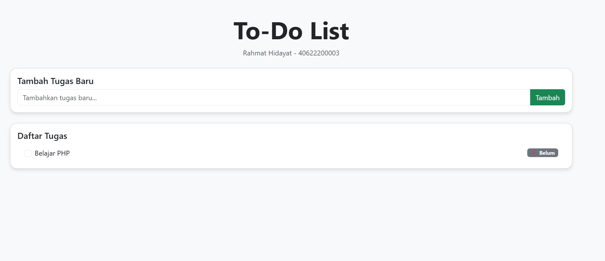

# Aplikasi To-Do List

## Deskripsi
Aplikasi sederhana berbasis PHP untuk mencatat tugas harian

## Fitur
- Tambah Tugas
- Tandai Tugas Selesai (ubah status)
- Hapus Tugas

## Struktur Folder
- `index.php` - Halaman utama menggunakan session
- `index_db.php` - Halaman dengan penyimpanan database
- `assets/` - Berisi file `bootstrap.min.css` dan screenshot (jika ada)
- `todolist.sql` - Struktur database MySQL

## Cara Menjalankan
1. Salin folder ke `htdocs\` (jika pakai XAMPP)
2. Jalankan XAMPP dan buka `http://localhost/todolist`
3. Untuk versi database:
   - Buat database baru `todolist_db`
   - Import file `todolist.sql` via phpMyAdmin

## Teknologi yang Digunakan
- PHP (native)
- MySQL
- Bootstrap 5

## Pratinjau

## Kontributor
- [Rahmat Hidayat - 40622200003](https://github.com/couocapcuz/todolist)